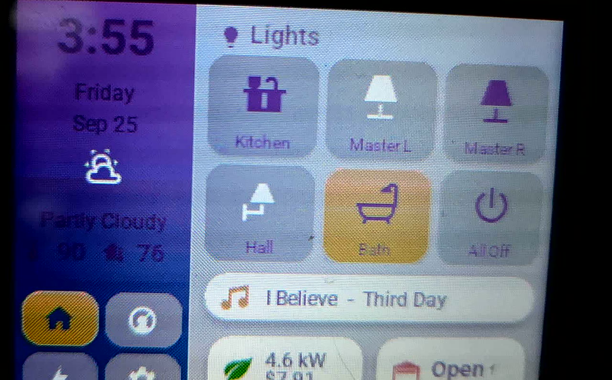
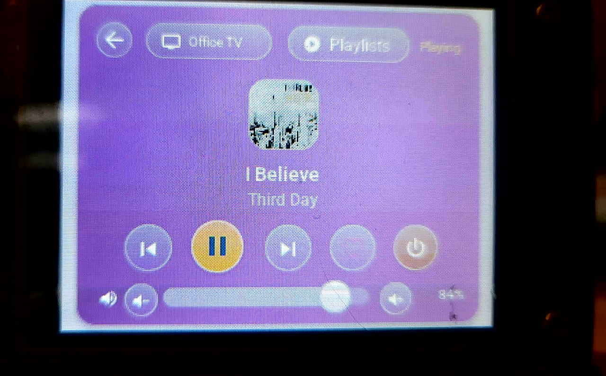
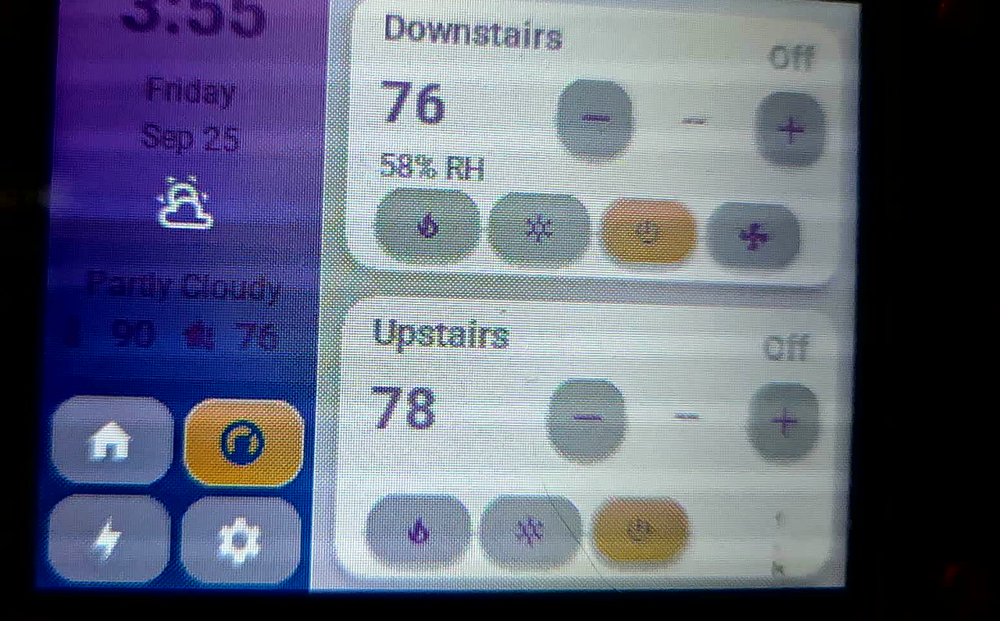
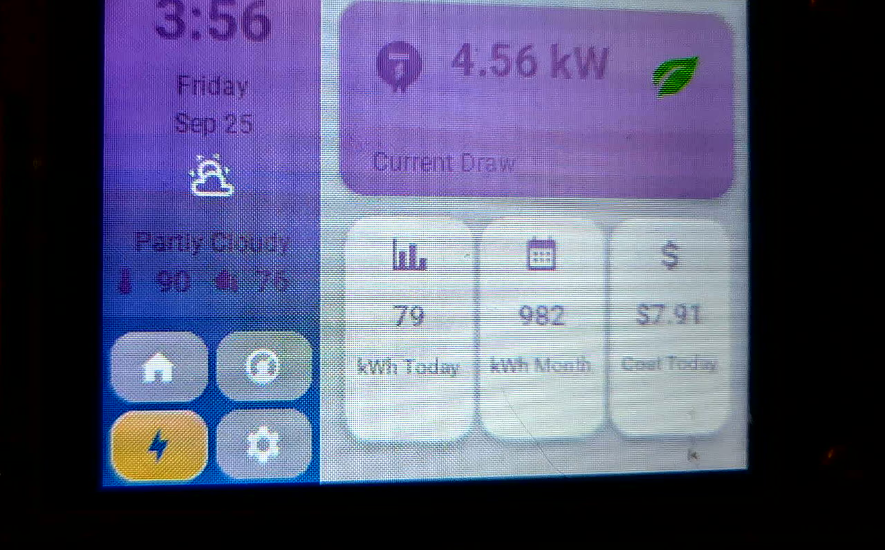
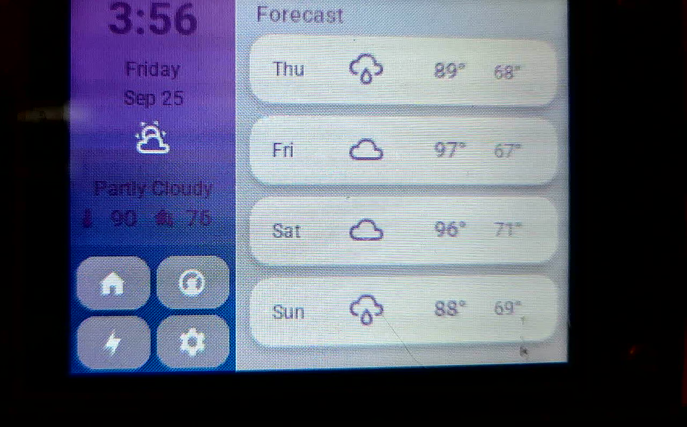

# cyd

An ESPHome + LVGL control panel for the ESP32 "Cheap Yellow Display" (CYD) — a 320x240 touch dashboard for Home Assistant with a fully custom UI.

All content is dynamic: every value, label, device, playlist and album cover is pulled from Home Assistant at runtime. There is no mock or hardcoded data in the UI, and sections gracefully hide themselves when their entities are missing.

## Screenshots

| Home | Media Player |
| --- | --- |
|  |  |

| Climate | Energy |
| --- | --- |
|  |  |

| Weather Forecast | |
| --- | --- |
|  | |

## Features

- **Lights** — kitchen, master (x2), hall and bath tiles with live on/off state, plus an all-off button
- **Climate** — two thermostats with setpoint control, HVAC mode chips, humidity and fan control
- **Energy** — live draw, daily/monthly kWh and today's cost
- **Weather** — 4-day forecast (high/low + condition icons) powered by a HA weather entity
- **Media player** — full-screen now playing with album art, play/pause, previous/next, favorite, TV power and volume; "Play On" and "Playlists" open near-full-screen dialogs with live device and playlist lists
- **Screensaver clock** — big clock with now playing and inside temperature, configurable sleep hours (screen stays dark) and 12h/24h format, all set from a full-screen Settings dialog
- **Boot splash screen**, idle dimming and touch-to-wake
- **Remote page control** — ESPHome API services (`show_page`, `show_dlg`, `set_playlists`, `set_weather`, `set_rotation`) let Home Assistant drive the display

## Setup

1. Create `YAML/secrets.yaml`:

   ```yaml
   wifi_ssid: "..."
   wifi_password: "..."
   api_key: "..."   # base64-encoded 32 byte key
   ```

2. Point the entity IDs in the `substitutions:` block at the top of `YAML/cyd.yaml` at your own Home Assistant entities.

3. Build and flash:

   ```bash
   esphome run YAML/cyd.yaml
   ```

### Home Assistant side

The media player and forecast pages are fed by a small HA script and a few automations:

- `script.cyd_media_sync` — returns available players, the selected player's now-playing info, artwork URL, favorite state, volume and top playlists
- `automation.cyd_playlists_sync` / `automation.cyd_weather_sync` — push playlists and daily forecast to the device

## Hardware

ESP32-2432S028 "Cheap Yellow Display" (CYD):

| Part | Details |
| --- | --- |
| MCU | ESP32-WROOM-32, dual-core Xtensa LX6 @ 240 MHz, 520 KB SRAM, 8 MB flash (as configured), 2.4 GHz Wi-Fi |
| Display | 2.8" 320x240 TFT, ILI9342 controller, SPI @ 80 MHz (clk 14, mosi 13, miso 12, cs 15, dc 2) |
| Touch | XPT2046 resistive touchscreen, dedicated SPI (clk 25, mosi 32, miso 39, cs 33, irq 36), calibrated and rotation-aware |
| Backlight | PWM via LEDC on GPIO21 — dimmed and blanked by the screensaver |
| Case LED | RGB LED on GPIO4/16/17 (common anode) |
| Extras | microSD slot, speaker header and LDR broken out on the board (unused here) |
| Case | 3D printed (files in `3D Print/`) |

What it does: a wall/desk Home Assistant dashboard that controls lights, two thermostats and a media player, shows live energy and a 4-day forecast, runs a clock/now-playing screensaver with configurable sleep hours, and can be driven remotely from HA automations over the encrypted native API. UI rotation can be flipped between 0° and 180° at runtime from the Settings dialog or the `set_rotation` API service.

## ESPHome 2026.9.0 features used

- **esp-idf** framework on ESP32, encrypted native API (Noise PSK) and OTA updates
- **LVGL 9** — pages, top layer, styles and widget themes, plus runtime software display rotation (`lvgl.display.set_rotation`)
- **Google Fonts (gfonts)** Roboto at three weights and the Material Design Icons webfont, rendered with 8-bit anti-aliased glyphs
- **online_image** over **http_request** for Music Assistant album art, with an icon fallback when a track has no artwork
- **Home Assistant integration** — sensors, binary sensors and text sensors, `homeassistant.action` with `capture_response` (service responses parsed as JSON inside lambdas) and `api.on_client_connected` re-sync triggers
- **SNTP time** with `on_time` / `on_time_sync` automations
- **Scripts** with parameters, **globals** with flash restore, intervals, and touchscreen `on_touch` automations
- **API user services** — `show_page`, `show_dlg`, `set_playlists`, `set_weather`, `set_rotation`
- **Diagnostics** — Wi-Fi info/signal, uptime, heap free/max-block/fragmentation debug sensors and a build stamp read from `App.get_build_time_string()`
- **LEDC PWM lights** with restore modes for the backlight and case LED

## Repository layout

- `YAML/cyd.yaml` — the entire firmware: hardware config, scripts, LVGL theme, styles and pages
- `images/` — screenshots used above
- `3D Print/` — case STL files

## Fonts & icons

Text uses Roboto via Google Fonts; icons use the [Material Design Icons webfont](https://github.com/Templarian/MaterialDesign-Webfont).
